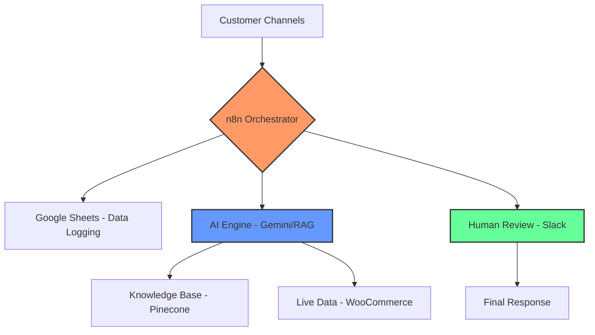
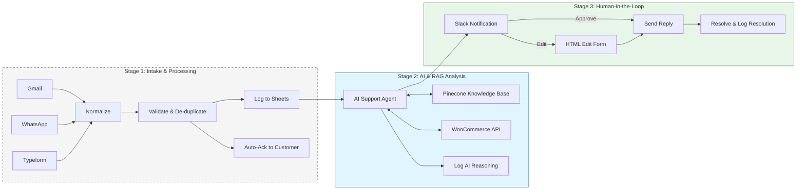
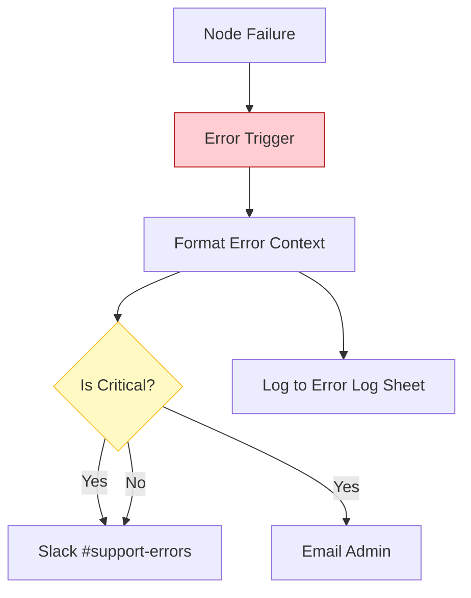

# Architecture: AI-Human Hybrid Customer Support Management

This document outlines the architectural design of the AI-Human Hybrid Customer Support Management system, built using **n8n**.

## 1. System Overview

The system is designed to automate the initial stages of customer support while keeping a human expert in the loop for final approval. It integrates multiple communication channels, uses AI for ticket classification and drafting responses (using RAG), and provides a seamless interface for human agents to review and send replies.

### High-Level System Map

## 2. Detailed Workflow

The workflow is divided into three main stages, ensuring data integrity, AI accuracy, and human oversight.

### Full Operational Flow

### Stage 1: Ticket Intake and Pre-processing
*   **Triggers:** The system listens for new support requests from:
    *   **Gmail:** Support inbox polling.
    *   **Typeform:** Form submissions.
    *   **WhatsApp:** Business API messages.
    *   **Generic Webhook:** For Tally forms or other custom integrations.
*   **Normalization:** A unified schema is created regardless of the source.
*   **Validation:** Basic checks for message length and content.
*   **Duplicate Detection:** Checks Google Sheets for recent open tickets from the same customer to avoid redundant processing.
*   **Logging:** New tickets are logged into the **Google Sheets ("Tickets" sheet)**.
*   **Acknowledgement:** An automated "We received your request" message is sent back to the customer via the original channel.

### Stage 2: AI Analysis & RAG (Retrieval-Augmented Generation)
*   **AI Agent:** Uses **LangChain** with **Google Gemini** as the LLM.
*   **Knowledge Retrieval (RAG):** The agent queries a **Pinecone** vector database (Knowledge Base) for relevant policies and FAQs.
*   **Tool Integration:** The agent can check real-time data:
    *   **WooCommerce Orders:** To check order status and history.
    *   **WooCommerce Products:** To get product details.
*   **Analysis:** The AI classifies the ticket category, assigns an urgency level (1-3), and drafts a professional response based on retrieved facts.
*   **Escalation Logic:** If the urgency is "Critical" (Urgency 1), a high-priority alert is sent to Slack.

### Stage 3: Human-in-the-Loop Review
*   **Slack Interaction:** The AI's analysis and draft reply are sent to a Slack channel with interactive buttons (**Send**, **Edit**, **Escalate**).
*   **Edit Form:** If the agent chooses "Edit", a custom HTML form (served via n8n webhook) allows them to modify the reply.
*   **Final Action:** Once approved or edited, the reply is sent to the customer via Gmail or WhatsApp.
*   **Resolution:** The ticket status is updated to "Resolved" in Google Sheets, and a final log is created in the "Resolutions" sheet.

## 3. Tech Stack

*   **Automation Engine:** [n8n](https://n8n.io/)
*   **Large Language Model (LLM):** Google Gemini (via LangChain)
*   **Vector Database:** Pinecone (for RAG)
*   **Data Storage:** Google Sheets
*   **Communication:** Slack (Internal), Gmail & WhatsApp (External)
*   **E-commerce Integration:** WooCommerce (REST API)

## 4. Data Model (Google Sheets)

The system uses a Google Spreadsheet with the following sheets:
*   **Tickets:** Main log of all incoming requests and their current status.
*   **AI Log:** Detailed logs of AI reasoning, tools used, and confidence scores.
*   **Resolutions:** Tracking when and how tickets were resolved.
*   **Error Log:** Logs from the dedicated Error Workflow.

## 5. Error Handling & Observability

A dedicated **Error Workflow** handles any failures within the main process, ensuring high availability and notification of critical issues.

### Error Resolution Flow

*   **Error Trigger:** Catches node failures.
*   **Severity Assessment:** Categorizes errors as "CRITICAL" or "WARNING" based on the failed node (e.g., failures in sending replies are critical).
*   **Multi-channel Alerts:** Sends notifications via Slack (#support-errors) and Email to the administrator.
*   **Logging:** All errors are persisted in the "Error Log" sheet for auditing.
